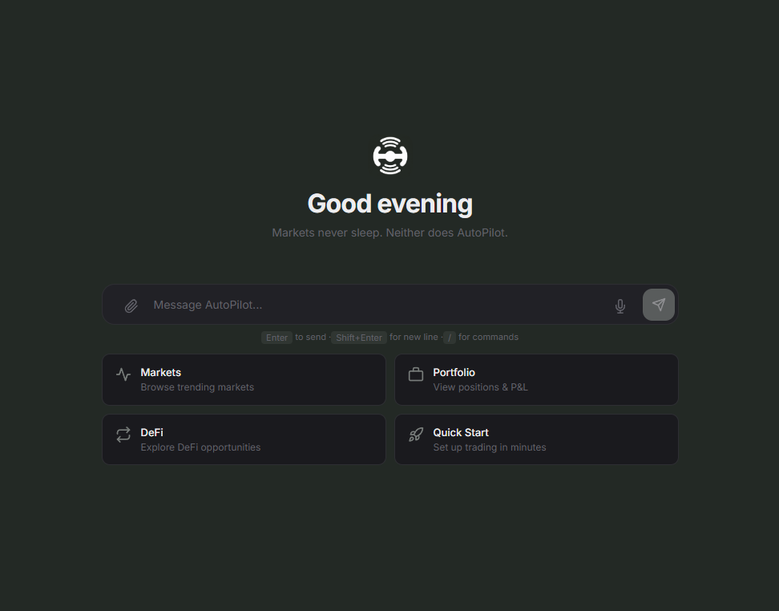

<p align="center">
  
</p>

<h1 align="center">AutoPilot</h1>

<p align="center">
  A self-hosted AI workspace for market research, automated trading and portfolio operations.
</p>

<p align="center">
  <a href="https://github.com/recogardtech/AutoPilotPM/releases/latest">Releases</a> ·
  <a href="./docs/USER_GUIDE.md">User guide</a> ·
  <a href="./docs/API_REFERENCE.md">API</a> ·
  <a href="./docs/DEPLOYMENT.md">Deployment</a> ·
  <a href="./SECURITY.md">Security</a>
</p>

---

AutoPilot brings conversational AI, market data, execution tools and automation into one local terminal. It supports prediction markets, spot and perpetual crypto, Solana and EVM DeFi, arbitrage research, portfolio tracking, token launches and Bittensor workflows.

The application can connect to real accounts, execute commands and submit transactions. Recommended to start by using the dry-run mode to fully understand and familiarise yourself with the bot.

## Start here

Requirements: **Node.js 22+**. Some exchange and mining integrations also require Python 3.

```bash
npm install -g https://github.com/recogardtech/AutoPilotPM/releases/latest/download/autopilot.tgz --loglevel=error
autopilot onboard
autopilot start
```

Open Dashboard at <http://127.0.0.1:18789/webchat>.

### Build from source

```bash
git clone https://github.com/recogardtech/AutoPilotPM.git
cd AutoPilotPM
npm install
cp .env.example .env
npm run build
npm start
```

### Docker

```bash
cp .env.example .env
docker compose up --build
```

The provided Compose configuration publishes the dashboard only on `127.0.0.1:18789`.

## What is included

| Area          | Capabilities                                                                                                              |
| ------------- | ------------------------------------------------------------------------------------------------------------------------- |
| Interfaces    | Built-in Dashboard, CLI, REST/WebSocket API, MCP and 20+ messaging channels                                               |
| Markets       | Polymarket, Kalshi, Betfair, Smarkets, Drift, Manifold, Metaculus, PredictIt, Opinion.xyz, Predict.fun and AgentBets data |
| Futures       | Binance, Bybit, Hyperliquid, MEXC, Drift, Percolator and Lighter                                                          |
| Automation    | 118+ strategies and presets, bots, cron jobs, webhooks, alerts and copy trading                                           |
| Research      | Order books, candles, external signals, whale tracking, semantic matching and arbitrage discovery                         |
| Risk          | Position limits, Kelly sizing, VaR/CVaR, stress tests, circuit breakers, daily-loss controls and kill switch              |
| AI            | Multiple LLM providers, specialized agents, tool calling, semantic memory and context compaction                          |
| Storage       | SQLite state and chat history, LanceDB memory, optional PostgreSQL analytics                                              |
| DeFi          | Solana and EVM swaps, lending, bridging, MEV protection, payments and token launch workflows                              |
| Extensibility | 120+ bundled skills, extensions, plugins and MCP tools                                                                    |

### Market coverage

- **Prediction markets:** live execution and research across CLOB, regulated, sports and forecasting platforms.
- **Perpetual futures:** long/short positions, leverage, TP/SL, funding and liquidation monitoring. Maximum leverage depends on the venue and can reach 200x.
- **Solana:** Jupiter, Raydium, Orca, Meteora, Kamino, MarginFi, Solend, Pump.fun and Bags.fm, with Jito support.
- **EVM:** Uniswap V3, 1inch, PancakeSwap, Virtuals, Clanker and Veil on Ethereum, Base, Arbitrum, Optimism and Polygon.
- **Cross-chain and payments:** Wormhole transfers and x402 USDC payments.

### Intelligence and automation

AutoPilot combines four main agent roles-general, trading, research and alerts-with providers such as Claude, OpenAI, Gemini, Groq, Together, Fireworks, Bedrock and Ollama. Memory uses persistent facts, user profiles, semantic retrieval and compacted conversation history.

Trading workflows include:

- mean reversion, momentum, market making and DCA;
- internal, cross-platform and combinatorial arbitrage;
- whale monitoring and controlled copy trading;
- smart routing, backtesting and P&L analysis;
- a decision ledger with confidence calibration and optional on-chain anchoring;
- GoPlus token checks, scam-address screening and pre-trade validation.

## Dashboard / WebChat

The browser client provides project folders, conversation search, artifacts, extracted code, paginated history and automatic context compaction. Sessions are stored locally and survive restarts.

<p align="center">
  
</p>

## Useful commands

```bash
autopilot onboard          # Guided configuration
autopilot start            # Start the gateway and Dashboard
autopilot repl             # Terminal conversation
autopilot doctor           # Environment diagnostics
autopilot secure           # Security checks and hardening
autopilot mcp              # Run the MCP server
autopilot mcp install      # Configure compatible MCP clients
autopilot locale set ru    # Select a UI language
autopilot bittensor setup  # Configure Bittensor tooling
autopilot ledger stats     # Inspect the decision ledger
```

The interface supports English, Chinese, Spanish, Japanese, Korean, German, French, Portuguese, Russian and Arabic.

## Configuration

Create `.env` from `.env.example` and add only the credentials required by the integrations you plan to use.

```dotenv
ANTHROPIC_API_KEY=

AUTOPILOT_TOKEN=<long-random-token>
WEBCHAT_TOKEN=<different-long-random-token>
DRY_RUN=true

# Optional channels
TELEGRAM_BOT_TOKEN=
DISCORD_BOT_TOKEN=
```

Local state is stored under `~/.autopilot/` unless overridden with `AUTOPILOT_STATE_DIR`, `AUTOPILOT_WORKSPACE` or `AUTOPILOT_CONFIG_PATH`.

## Additional modules

- **Bittensor:** wallet operations, subnet registration, mining status and earnings history, including Chutes SN64 workflows.
- **Percolator:** Solana-native perpetuals, slab polling, oracle data, keeper operations and settlement monitoring.
- **Token launch:** Meteora Dynamic Bonding Curves, anti-sniper fees, automatic AMM graduation and creator-fee delegation.
- **Agent forum:** agent identities, discussions, voting, follows and consent-based messaging.
- **Marketplace:** code, APIs and datasets sold through Solana USDC escrow with reviews and seller statistics.
- **Compute API:** metered LLM, code, web, data, storage and trade services paid through USDC.

## Documentation

| Document                                   | Purpose                                    |
| ------------------------------------------ | ------------------------------------------ |
| [User guide](./docs/USER_GUIDE.md)         | Commands, channels and common workflows    |
| [API reference](./docs/API_REFERENCE.md)   | HTTP and WebSocket endpoints               |
| [Architecture](./docs/ARCHITECTURE.md)     | Components, data flow and extension points |
| [Trading](./docs/TRADING.md)               | Execution, strategies and risk controls    |
| [Deployment](./docs/DEPLOYMENT.md)         | Docker, services and production setup      |
| [Security audit](./docs/SECURITY_AUDIT.md) | Existing security notes and checklist      |
| [OpenAPI](./docs/openapi.yaml)             | Machine-readable API schema                |

## Development

```bash
npm run dev
npm run typecheck
npm test
npm run build
```

Issues and releases are managed at <https://github.com/recogardtech/AutoPilotPM>.

## License

Released under the [MIT License](./LICENSE).
